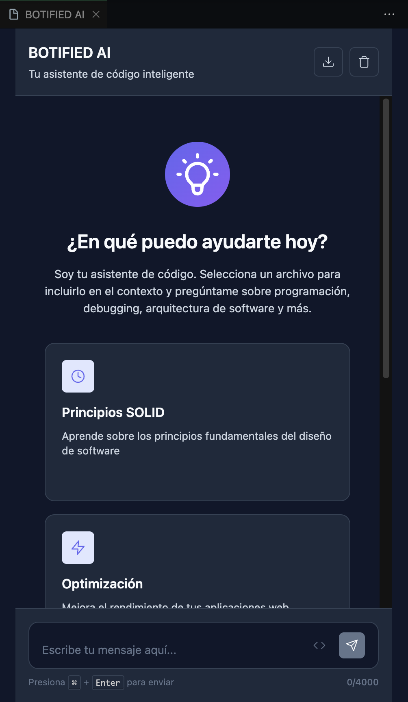

  <h1>Botified Extension for VSC</h1>
  

Botified is a powerful Visual Studio Code extension designed to assist developers with code generation, file management, editing tasks, and issue reporting using artificial intelligence.

## Features

- **Code Generation**: Ask the chatbot for code snippets, solutions, or explanations.
- **Custom File Management**: Generate files in specific locations and edit them directly.
- **Integrated Chat Assistant**: Interact with the chatbot seamlessly within your coding environment.
- **Keyboard Shortcuts**: Customize shortcuts for quick access to the chatbot.
- **Issue Reporting**: Easily report issues or bugs directly from the extension.

## Preview

  

## How to Use

1. Open the command **Open Botified Chat** from the command palette.
2. Use the shortcut `Ctrl + Alt + 0` on Windows or `Ctrl + Cmd + 0` on macOS to quickly open the chat.
3. Ask coding-related questions, generate files, or edit existing ones.
4. Report issues or bugs using the integrated issue reporting feature.

## Development Guide

To work on Botified in development mode:

### Windows
- Press `F5` to start debugging the extension.

### macOS
- Press `fn + F5` to start debugging the extension.

 

Make sure to have all dependencies installed and the workspace properly configured before running the extension.

### Contact Information

- **Gaston Rodríguez**: [LinkedIn](https://www.linkedin.com/in/gaston-rodriguez-herrera)
- **Gabriel Ventura**: [LinkedIn](https://www.linkedin.com/in/gabriel-francisco-ventura-moreno)
